# pwn/52-card-monty
In order to make this writeup more beginner-friendly,
I put in a few sections that explain some binary executable concepts, as well as
links to skip to relevant parts of the solve.

I assume that the reader knows how to perform a basic buffer overflow attack (overwritng a return address).

## Tools used
I used gdb and the Python pwntools library. There are more tools out there (eg. gef) that make a lot of the things I do in this solve way easier.

Some of the techniques I used are quite gimmicky, but feasible for a complete beginner (because I am a complete beginner).

## What are we dealing with?
We're given source code `monty.c` and a binary `monty`. First, we `checksec` the binary:

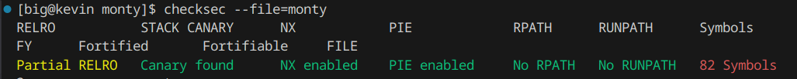

The relevant things to notice is that the stack canary, NX, and PIE are all enabled.

### These Defenses [(skip)](#looking-at-the-source-code)

#### Stack Canary
A stack canary is some 64-bit value inserted onto the stack whenever a function is called. Then, when the function returns, the stack canary is checked to see if it remained unchanged. If it changed, then the program is killed.

This provides us a challenge: the canary lies between our buffer and the return address we want to overwrite. In order to overwrite the return address without causing the killing of the program, we have to somehow preserve the value of the canary when we buffer overflow.
If we could leak the canary value, then we can easily preserve it when overflowing.

#### NX Enabled
This means that the stack is not executable; we cannot simply write code in the stack and return to it. We need to use the code that the executable gave us.

#### PIE Enabled
This means that the executable is position-independent; the memory addresses of functions and the stack will have a random offset added to them.

This presents us with another challenge: if we have to overwrite a return address with the address of a desired function, how do we figure out where that desired function is? We need to somehow leak the random offset.

### Looking at the source code
We see a `win()` function. It's clear that we have to call it to get the flag, but it's not called anywhere in the program. We will have to overwrite some return address with the address of `win`.

We now examine `game()`. It allocates an array of 52 longs, as well as buffer of 20 chars. 
`game` plays through a game of monty, but when we win by guessing the queen, nothing interesting happens. We are thus fairly confident that we don't actually have to win the game.

The game consists of a series of peeks at the deck.
The function reads in an integer `idx` from `stdin`, and then uses `idx` to index into the `cards` array. 

It appears to mitigate out-of-bounds accesses by modding `idx` with `DECK_SIZE`. But we refer to what `DECK_SIZE` is: `0x52`.

Aha!

`0x52` is actually 82 in decimal, which means that our `idx` is getting modded by 82, not the size of `cards`, 52. This means that we can index up to 30 longs out of bounds, which should be plenty to leak the canary and the return address of `game`. We can extract the random offset from the latter.

Finally, when `game` asks for a name, it reads 52 characters, which is more than the 20 character size of the `name` array. This is where we buffer overflow.

### Strategy

Our strategy appears to be:

1. Use the first peek to leak the canary
2. Use the second peek to leak the return address of `game`
3. (The input after "Show me the lady!" doesn't matter, we can send whatever integer we want)
4. Buffer overflow `name`, noting the leaked canary and return address.

We need to figure out where the canary is relative to the `cards` array. We also need to figure out where the return address is, relative to the `cards` array.

A canary is very easy to recognize, since its least significant byte is always 0x00.

The `cards` array is easy to recognize, because it's filled with random values, and has a randomly placed element with the value of `QUEEN`, which is 1111111111 = 0x423A35C7.


## GDB

We open up gdb. Let's set some breakpoints
at relevant locations:

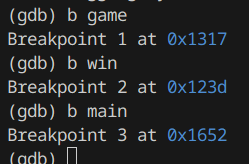

We note these addresses, for the purpose of calculating offsets later.

Now, we run. We first hit the breakpoint at `main`. We examine the `main` function in `layout asm`, and we scroll down to where it calls `game`.

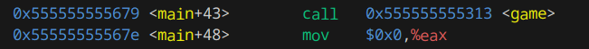

The instruction after the call to `game` is 0x...555567e. This will be the return address when `game` returns.

We now call `game`. We print out the contents of the stack: 

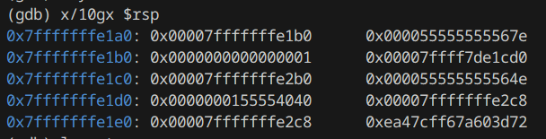

We see the return address 0x...555567e at address 0x7f...e1a8.

We also look at the code for `game`.

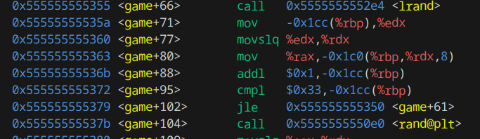

We recognize these `lrand()` calls from when the `cards` array is being setup. We also notice QUEEN (0x423a35c7) being setup at `<game+154>`:

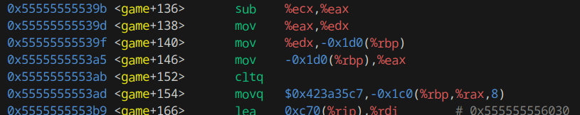

Let's continue until after all this setup is done, say at `<game+173>`. This is done with the gdb command:

```
(gdb) b *(game+173)
```

Now we examine the stack with

```
(gdb) x/100gx $rsp
```

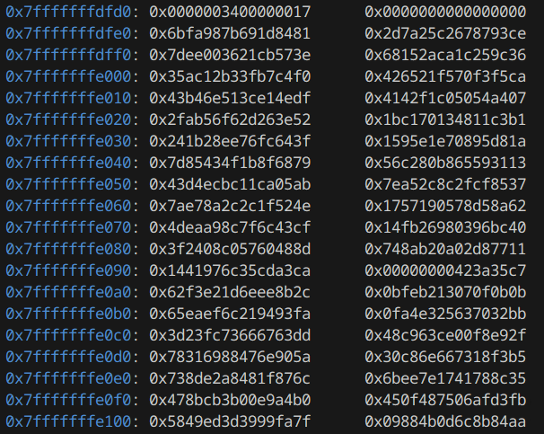
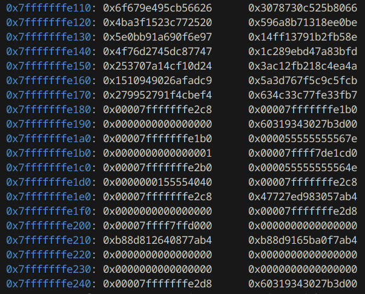

There's a lot of interesting things to unpack here. Firstly, the `cards` array appears to start at 0x7f...dfe0. Note the QUEEN at a random location.

Secondly, notice that at 0x7f...e198, there's a value of 0x60319343027b3d00. Its least significant byte is 0x00 and its location is just above the return address at 0x...e1a8; this is the canary!

This run gives us enough information to leak the canary, the return address, and calculate the random offset of addresses. We can exit out of gdb now.

## Some Math and Substraction

The only thing we need to figure out now is where the buffer of `name` starts. Well actually, we don't need to figure out exactly where it is, only where it is relative to the canary.

We can simply binary search on the length of the required input to cause a stack-smashing error:

First try (error):

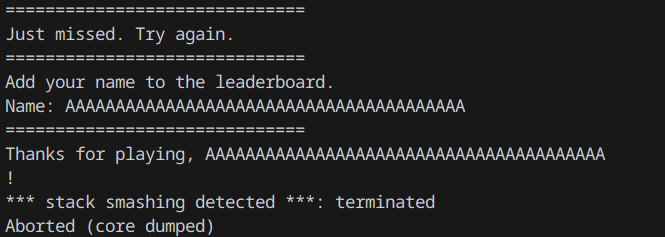

Second try (no error):

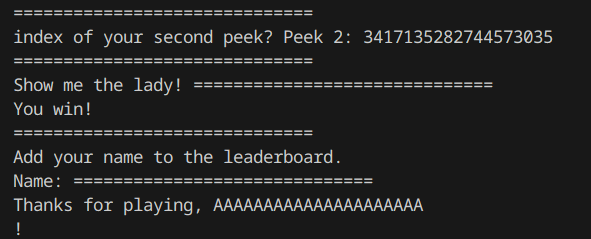

Third try (error):

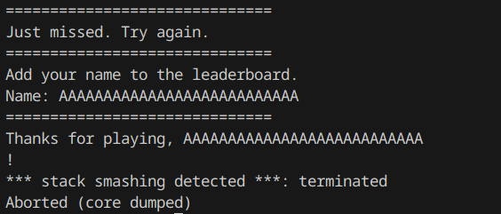

...This continues until we find that the longest string that we can type in as our name without causing an error is

```
AAAAAAAAAAAAAAAAAAAAAAA
```

This string has length 23. Remembering that our string is appended with a nullbyte, this means that this string is actually 24 long.

So, the padding for our payload is 24.

Next, we calculate the offset at which to index into `cards` to leak the canary. The canary is at 0x...e198 and `cards` is at 0x...dfe0. Subtracting these two gives 440 bytes, or 55 longs.

Then, we calculate the offset at which to index into `cards` to leak the return address. The address is at 0x...e1a8. subtracting this from `cards` gives 456 bytes, or 57 longs.

Finally, we figure out the address of `win`, given the leaked return address, which we will call `ret_addr`. `ret_addr` is `<main+48>`, so `ret_addr - 48` is the address of `main`.

`main` is at `0x1652` and `win` is at `0x123d` in the executable without random offsets. The difference is `0x415 = 1045`. Thus, the address of `win` with the random offset is `ret_addr - 48 - 1045`.

## Writing the Payload

The structure of our payload is:
```
padding: 24 bytes
canary: 8 bytes (at 0x...e198)
padding: 8 bytes
win address: 8 bytes (at 0x...e1a8)
```

We use Python's pwntools to help us write this. The script is in `attack.py`.

We get the flag from the server: `lactf{m0n7y_533_m0n7y_d0}`

While in theory we could alternatively use online sources that convert decimal to hex,
and hex to strings that we then copy, the server kicks us before we can do all that manually.